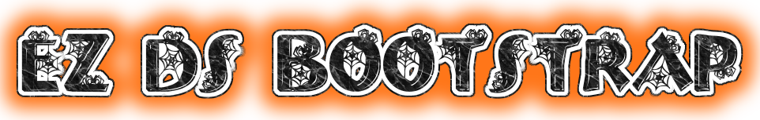

Trying to make it super easy to get your environment set up for Nintendo DS development

After hours and hours of trying to figure out what the hell is going on, I finally figured out how to compile this.

# tl;dr
- git clone this project
- make a folder in the newly cloned directory (this is where you will put your DS code)
- follow the steps in the "Docker config" section below

# Elevator pitch
For actually making DS software you are going to need to figure that out yourself. This repo aims to eliminate a very annoying step of figuring out all the stuff you need to have working in unison before the code you write even becomes a Nintendo DS application. Imagine if you wanted to make a game in Unity or Unreal Engine but instead of simply going to their website and downloading the program to make the games, you had to sift for hours through various blog posts, forums, reddit, get compile errors because a project is using something you haven't heard of yet etc etc. As developers we don't want them. Some people do but we don't. You should be focused on making things work in your software, not in your tool chains. I will try my hardest to make a complete package here for you so you only need to do a few things to get up and running and design your dream game or app. The Nintendo DS is awesome and really something out of a dream, it shouldn't be a nightmare to code for.

# What is docker?
In short docker, using figurative language, Docker serves a purpose sort of like the DS does. Instead of having to manually download a bunch of stuff and glue it all together, a person could easily make a configuration and or make a "container" so that a developer can simply get started working on something rather than figure out the unimportant scenarios of why x is working with y, and it z is up-to-date with x. Think of it as plugging a game cartridge into the DS and simply pressing power to see the game come up on the screen (rather than asking the player to install the toolchains on their own computer and compile their own code!).

## Docker config
Very work in progress instructions but here goes:

git clone this branch and enter it via the sCaRy TeRmInAl.

run:

Download devkitpro docker image and configure things:

`docker-compose build`

after everything downloads and stuff run

`docker-compose up`

### Enter the container:

`docker-compose exec devkitpro /bin/bash`

### once in the container run:

`apt install pip`

`pip install pillow`

`pip install image`
(I know I should have this in the Dockerfile but it wasn't working I'll fix it later)
 
### How the hell do I make the .nds file now? 

In the root folder you can run: 

`docker-compose exec devkitpro make`

## OR 

you can use:

`docker-compose exec devkitpro /bin/bash`

and navigate the file system and use make from there.

# Learning Resources

### Examples

Look at the tutorials folder for examples. See if you can `make` some of the example projects.

### Read other peoples code!

Thankfully there are more projects on Github now relating to this.

### Videos

- great video of Break bad home brew game: https://www.youtube.com/watch?v=HiiZxOU934E
- MVG made a nice overview of the graphics on the NDS: https://www.youtube.com/watch?v=kBgQJJ93nFM

### Guides and References

- Big N's official docs maybe? https://archive.org/details/NitroDevDocs
- This is an ebook but you can read the free version on their site https://www.copetti.org/writings/consoles/nintendo-ds/
- Great repo with more code examples and teachings https://github.com/jdriselvato/NDS-Homebrew-Development
- Another nice over view of NDS development stuff https://www.chibialiens.com/arm/nds.php
- NDS Homebew Development https://github.com/jdriselvato/NDS-Homebrew-Development
- GBA dev stuff but probably still helpful https://www.coranac.com/tonc/text/toc.htm

### Code to study

- https://github.com/vrodin/Burn2Slot
- https://github.com/AntonioND/nitro-engine
- https://github.com/Fewnity/Nintendo-DS-Nifi-Template
- https://github.com/WiIIiam278/breaking-bad-ds
- https://github.com/asiekierka/nitrotracker
- https://github.com/rhaleblian/dslibris
- https://github.com/FluBBaOfWard/NGPDS
- https://github.com/FluBBaOfWard/NitroSwan

# Final thoughts

Happy Hacking!
